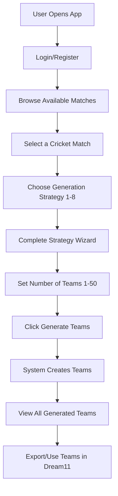
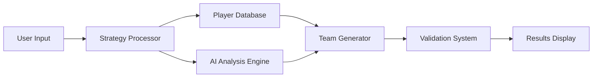

# Dream11 Multi-Team Creator: 
---

## Table of Contents
1. [Project Overview](#1-project-overview)
2. [Overall User Journey](#2-overall-user-journey)
3. [System Architecture](#3-system-architecture)
4. [Complete Strategy Breakdown](#4-complete-strategy-breakdown)
5. [How Multiple Teams Are Created](#5-how-multiple-teams-are-created)
6. [Behind-the-Scenes Magic](#7-behind-the-scenes-magic)

---

## 1. Project Overview

The Dream11 Multi-Team Creator is a smart assistant that helps cricket fans create multiple fantasy cricket teams for the same match. Instead of manually picking players one by one for each team, users can choose from eight different "strategies" that automatically generate multiple unique lineups based on their preferences.

**What makes it special:**
- Creates up to 50 different teams at once
- Each team follows Dream11 rules (exactly 11 players, under 100 credits)
- Teams are guaranteed to be different from each other
- Uses real cricket data and AI to make smart selections
- Provides reasoning for every team created

---

## 2. Overall User Journey

### Step-by-Step User Experience:

**Step 1: Getting Started**
- User logs into the platform
- Views a list of upcoming cricket matches (like Pakistan vs England)
- Clicks on the match they want to create teams for

**Step 2: Strategy Selection**
- Eight strategy cards appear on screen, each with a different approach:
  - "AI Chat Assistant" - Talk to AI about your preferences
  - "Same Players, Different Captains" - Keep same 11, vary leadership
  - "Score Prediction Based" - Teams optimized for predicted match scenario
  - "Core + Backup Strategy" - Mix safe picks with risky ones
  - "Numbers-Based Filters" - Use statistics to filter players
  - "Ready-Made Scenarios" - Choose from pre-built strategies
  - "Role-Specific Teams" - Control exact player positions
  - "Modify My Base Team" - Start with your XI and create variations

**Step 3: Complete the Wizard**
- Each strategy opens a simple step-by-step form
- Users answer questions or make selections specific to that strategy
- System validates inputs and shows preview

**Step 4: Generate and Review**
- User chooses how many teams to create (1-50)
- Clicks "Generate Teams"
- System creates all teams within seconds
- Results show each team with captain badges, expected points, and reasoning

---

## 3. System Architecture

### How the System Works Behind the Scenes:

**Data Sources:**
- **Player Information:** Names, roles (batsman/bowler/etc.), credits, recent performance
- **Match Details:** Teams playing, venue, pitch conditions, weather
- **Historical Data:** Past performance, head-to-head records, venue statistics

**Processing Engine:**
- **AI Components:** OpenAI/Gemini for intelligent analysis and recommendations
- **Rule Engine:** Ensures all teams follow Dream11 rules
- **Diversity Engine:** Makes sure teams are sufficiently different from each other
- **Optimization Engine:** Balances performance potential with risk management

---

## 4. Complete Strategy Breakdown

### Strategy 1: AI-Guided Conversational Assistant

**What the User Does:**
- Starts a chat conversation with an AI assistant
- AI asks questions like "Match Winner?", "Score Range?", "Backed Players?", "Match Story?", "Risk Appetite"
- User responds in natural language
- AI refines its understanding with each answer

**How Multiple Teams Are Created:**
- AI analyzes all conversation responses
- Identifies key preferences (aggressive vs safe, batting vs bowling focus, etc.)
- Creates first team based on strongest preferences
- Generates variations by adjusting confidence levels, trying alternate captain choices.
- Each team represents a different interpretation of user preferences

---

### Strategy 2: Same XI, Different Captains

**What the User Does:**
- Manually selects exactly 11 players they want in every team
- Defines captain/vice-captain combinations with percentages (e.g., "Babar as captain in 40% of teams, Rizwan in 30%, others in 30%")
- Total percentages must equal 100%

**How Multiple Teams Are Created:**
- System keeps the same 11 players in every team
- Changes only the captain and vice-captain based on user percentages
- For 10 teams with 40% Babar captain: first 4 teams have Babar as captain
- Remaining teams distribute other captaincy options according to percentages

**Example:**
User picks 11 players and sets: Babar 50%, Rizwan 30%, Shaheen 20%
- Teams 1-5: Babar (C), others (VC)
- Teams 6-8: Rizwan (C), others (VC)
- Teams 9-10: Shaheen (C), others (VC)

---

### Strategy 3: Score & Storyline Prediction

**What the User Does:**
- Views auto-detected match conditions (pitch, weather, venue)
- Makes predictions about match outcome (high/medium/low scores, top performers)
- AI analyzes predictions and creates match narrative
- Reviews AI analysis before generating teams

**How Multiple Teams Are Created:**
- AI creates a "storyline" for the match based on user predictions
- Builds teams optimized for different aspects of that storyline
- If prediction is "high-scoring match," creates teams with different batting combinations
- Generates teams for various captain choices within the predicted scenario
- Each team represents a different way to capitalize on the predicted match flow

**Example:**
User predicts "Team A will score 180+, Team B will collapse to 140"
- Team 1: Heavy on Team A batsmen, Team B death bowlers
- Team 2: Team A top-order focus, Team B middle-order bowlers
- Team 3: Team A all-rounders, Team B opening bowlers

---

### Strategy 4: Core + Hedge Selection

**What the User Does:**
- Sorts players into three categories: Core (must-have), Hedge (rotation options), Differential (risky picks)
- Sets captain priority order
- Defines how many teams should include hedge vs differential players

**How Multiple Teams Are Created:**
- Every team includes most/all core players as foundation
- Even-numbered teams (2, 4, 6...) get hedge players added
- First few teams get differential players for upside potential
- Remaining slots filled with best available players
- Captain rotates through priority order across teams
- Each team has a different risk/reward profile

**Example:**
Core: 6 players, Hedge: 4 players, Differential: 2 players, 8 teams total
- Teams 1-2: Core + Differential players (high risk/reward)
- Teams 3-4: Core + Hedge players (balanced)
- Teams 5-6: Core + best remaining (safe)
- Teams 7-8: Core + different hedge/differential combinations

---

### Strategy 5: Stats-Driven Guardrails

**What the User Does:**
- Sets numerical filters for player selection (e.g., "Dream Team % between 40-70%")
- Defines role composition limits (e.g., "3-5 batsmen, 2-4 all-rounders")
- Chooses primary optimization metric (average points vs selection percentage)

**How Multiple Teams Are Created:**
- System filters all players to only those meeting the statistical criteria
- If enough players pass filters (15+), uses advanced AI optimization
- Otherwise, uses greedy selection within constraints
- Creates teams by rotating through filtered players in different combinations
- Each team maximizes the chosen metric while staying within guardrails
- Captain selection varies across teams using eligible players

**Example:**
Filter: Dream Team % 30-60%, 4-5 batsmen, 15 players pass filter, 5 teams requested
- Team 1: Top 4 batsmen by average points, rotate others
- Team 2: Top 5 batsmen by selection %, different all-rounders  
- Team 3: Mix of high/low ownership players within filters
- Teams 4-5: Different combinations of filtered players

---

### Strategy 6: Preset Scenarios

**What the User Does:**
- Chooses from 8 ready-made scenarios like "Team A High Total," "All-Rounder Heavy," "Death Overs Specialists"
- Reviews preset strategy and risk level
- Confirms number of teams

**How Multiple Teams Are Created:**
- Each preset has built-in constraints (e.g., "All-Rounder Heavy" = minimum 4 all-rounders)
- System generates base team following preset rules
- Creates variations by randomly swapping ~25% of players each time
- Ensures each new team is at least 25% different from existing teams
- Up to 50 attempts per team to achieve diversity target
- Falls back to best available team if diversity target can't be met

**Example:**
"Team A High Total" preset for 5 teams:
- Base: 5 Team A batsmen, 3 Team B bowlers, mixed others
- Team 1: Exact base team
- Team 2: Swap 3 players (27% different from Team 1)
- Team 3: Swap 3 different players (25% different from others)
- Teams 4-5: Continue swapping to maintain diversity

---

### Strategy 7: Role-Split Lineups

**What the User Does:**
- Defines exact composition: X top-order batsmen, Y middle-order, Z spinners, W pacers, etc.
- Sets diversity level (low/medium/high) for how different teams should be
- Chooses additional preferences (prioritize form, balance credits)

**How Multiple Teams Are Created:**
- System enforces exact role counts in every team
- Builds each team by selecting players for each role category
- Uses rotation system to pick different players for same roles across teams
- Checks diversity score against existing teams
- Continues generating attempts until diversity threshold is met
- Each team strictly follows the role-split configuration but uses different player combinations

**Example:**
Config: 3 top-order, 3 middle-order, 2 spinners, 1 pacer, 1 keeper, 1 all-rounder, 3 teams
- Team 1: Best top-order batsmen #1-3, best spinners #1-2, etc.
- Team 2: Best top-order batsmen #2-4, best spinners #2-3, etc.
- Team 3: Best top-order batsmen #3-5, different spinner combination

---

### Strategy 8: Base Team + Rule-Based Edits

**What the User Does:**
- Manually selects exactly 11 players as starting base team
- Sets optimization rules: primary metric (Dream Team % vs points), guardrails (max per role, credit limits)
- Chooses edit intensity: Minor (1-2 swaps), Moderate (2-4 swaps), Major (3-6 swaps)

**How Multiple Teams Are Created:**
- Starts with user's base team for every generation
- Determines number of edits based on intensity and team index
- Makes systematic player swaps while respecting guardrails
- Validates each edit maintains Dream11 rules
- Falls back to base team if edits create invalid composition
- Reassigns captain/vice-captain after edits
- Each team is a controlled variation of the original base

**Example:**
Base team + Moderate intensity, 4 teams:
- Team 1: Base + 2 swaps (different spinner, different batsman)
- Team 2: Base + 3 swaps (different keeper, 2 different bowlers)
- Team 3: Base + 2 swaps (different all-rounder, different captain choice)
- Team 4: Base + 4 swaps (multiple position changes within guardrails)

---

## 5. How Multiple Teams Are Created

### Universal Principles Across All Strategies:

**1. Diversity Enforcement**
- Every strategy ensures teams are meaningfully different
- Minimum variation requirements (usually 25% different players)
- No duplicate teams allowed
- Captain/vice-captain variations even with same players

**2. Dream11 Rule Compliance**
- Exactly 11 players per team
- Total credits ≤ 100
- Maximum 7 players from one real team
- Minimum 1 wicket-keeper
- Role composition follows valid patterns

**3. Systematic Variation Methods**
- **Rotation Systems:** Cycle through player pools in different orders
- **Random Sampling:** Introduce controlled randomness for diversity
- **Confidence Scaling:** Adjust player selection confidence for variations
- **Captain Permutation:** Systematically vary leadership choices
- **Constraint Relaxation:** Slightly adjust filters/rules for each team

**4. Quality Assurance**
- Validate each team before finalizing
- Calculate expected points and confidence scores
- Generate reasoning for every team
- Provide performance insights and risk assessment

---

## 6. Behind-the-Scenes Magic

### What Happens When You Click "Generate Teams"

**Phase 1: Input Processing (1-2 seconds)**
- System validates all user inputs
- Loads player database for the specific match
- Retrieves match conditions and historical data
- Prepares AI analysis engines

**Phase 2: Strategy Execution (3-5 seconds)**
- Runs strategy-specific algorithms
- AI analyzes player combinations and match dynamics
- Applies user preferences and constraints
- Generates initial team candidates

**Phase 3: Team Assembly (2-3 seconds)**
- For each team slot:
  - Selects players according to strategy rules
  - Validates Dream11 constraints
  - Ensures diversity from existing teams
  - Assigns captain and vice-captain
  - Calculates expected points and confidence

**Phase 4: Quality Control (1 second)**
- Double-checks all teams are valid
- Verifies sufficient diversity across teams
- Generates insights and reasoning for each team
- Formats results for display

**Phase 5: Results Delivery (instant)**
- Returns formatted teams to user interface
- Displays with visual indicators for captain/vice-captain
- Shows expected points, confidence, and strategy reasoning

---

