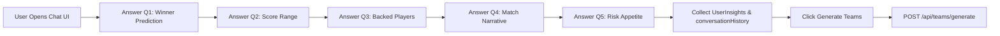
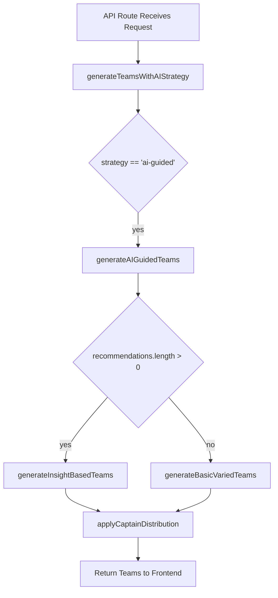

# Strategy 1: AI-Guided Conversational Assistant

## 1. Introduction
**Strategy 1** implements an AI-guided, chat-driven workflow that captures user insights via a brief conversation and uses those insights to generate multiple diverse fantasy teams with intelligent captain/vice-captain assignments. This document details the end-to-end workflow, backend logic, formulas, data sources, and AI integration points.

## 2. User Workflow

1. **Conversation UI** (`components/strategies/Strategy1Wizard.tsx`)
   - Presents 5 questions: match winner, score range, backed players, match narrative, risk appetite.
   - Stores responses in a `UserInsights` object and logs conversation history.
   - On completion, calls `onGenerate(strategyData, teamCount)` with:
     ```ts
     {
       strategy: 'ai-guided',
       userInsights,          // matchWinner, scoreRange, backedPlayers, matchNarrative, riskAppetite
       conversationHistory,    // full chat log
       captainDistribution,    // generated in UI (2 combos with %)
       matchAnalysis,         // optional server‐side pitch/weather analysis
       teamNames              // { teamA, teamB }
     }
     ```

2. **Team Generation Request**
   - In `app/match/[id]/teams/page.tsx`, `generateTeams(matchId, strategy, count, userPreferences)` invokes:
     ```ts
     fetch('/api/teams/generate', {
       method: 'POST',
       body: JSON.stringify({ matchId, strategy, teamCount, userPreferences })
     })
     ```
   - The API route logs and extracts `userPreferences` into top-level parameters for `aiService.generateTeamsWithAIStrategy(...)`.

## 2.3 Frontend Workflow Diagram



**Diagram Explanation:**
- The user interacts step-by-step with the chat UI (A → F).
- Insights and full chat history are gathered (G).
- A single button triggers the API call (H → I), passing structured preferences.

## 3. Backend Logic

### 3.1 API Route
- **File**: `app/api/teams/generate/route.ts`
- Validates `matchId`, `strategy`, `teamCount`.
- Extracts:
  ```ts
  aiService.generateTeamsWithAIStrategy({
    matchId: Number(matchId),
    strategy,
    teamCount,
    // For ai-guided:
    userInsights: userPreferences.userInsights,
    conversationHistory: userPreferences.conversationHistory,
    captainDistribution: userPreferences.captainDistribution,
    matchAnalysis: userPreferences.matchAnalysis,
    teamNames: userPreferences.teamNames
  });
  ```
- Logs full payload for debugging.

### 3.2 AI Service Pipeline
**File**: `lib/ai-service-enhanced.ts`

1. **Entry Point**: `generateTeamsWithAIStrategy(request)`
   - Checks `request.strategy === 'ai-guided' && request.userInsights`
   - Calls `generateAIGuidedTeams(request)`

2. **generateAIGuidedTeams(request)**
   ```ts
   // Logging inputs
   buildConversationalPrompt(userInsights, conversationHistory);
   aiAnalysis = await getAIResponse(prompt);
   recommendations = parseAIRecommendations(aiAnalysis);
   baseTeams = await generateInsightBasedTeams(recommendations, request);
   finalTeams = applyCaptainDistribution(baseTeams, captainDistribution);
   return finalTeams;
   ```

3. **getAIResponse(prompt)**
   - Routes to OpenAI or Gemini via `openAIService.generateChatbotResponse`.

4. **buildConversationalPrompt(insights, history)**
   - Constructs a free-form text prompt embedding:
     - User insights (winner, score range, narrative, risk appetite)
     - Full chat history
     - Match conditions (pitch, weather)

5. **parseAIRecommendations(aiResponse)**
   - Currently stubbed (returns empty array)
   - Logs first 200 characters for debugging.
   - **Result**: `recommendations.length === 0` triggers fallback.

6. **generateInsightBasedTeams(recommendations, request)**
   - If no recommendations: calls `generateBasicVariedTeams(request)`
   - Otherwise, enforces diversity:
     ```ts
     const minUnique = Math.ceil(11 * 0.25); // = 3
     createInsightVariation(userInsights, i);
     generateDiverseInsightTeam(..., minUnique);
     ```

7. **generateBasicVariedTeams(request)** (fallback)
   - Calls `generateAIPlayerRecommendations(matchId)` to get a pool of players.
   - For each team index `i`:
     ```ts
     const team = await generateSingleTeam(recommendations, request, i);
     // ensures `team.players` is populated
     ```

8. **applyCaptainDistribution(teams, distribution)**
   - For `distribution = [...]` array of `{ captain, viceCaptain, percentage }`:
     - Calculates number of teams per combo:
       ```ts
       count_i = round((percentage_i / 100) * totalTeams);
       ```
     - Calls `findBestPlayerMatch(team.players, captain)` and similarly for vice-captain.
     - Fallback: first/second player in list.

9. **findBestPlayerMatch(players, targetRole)**
   - Uses keyword map to match `targetRole` against `player.position` or `player.name`.
   - If no match: selects highest `projectedPoints` or `credits`.

## 3.3 Backend Workflow Diagram



**Diagram Explanation:**
- The API handler delegates to the AI service (A → B).
- For AI-guided requests, the service either runs the full conversational strategy (generateAIGuidedTeams) or falls back to basic generation.
- Teams are then finalized with diversity and captain distribution (H) and sent back to the UI (I).

## 4. Key Formulas & Rules

- **Diversity Guarantee**: `minUnique = ceil(11 * 0.25) = 3` unique players per team compared to previous teams.
- **Captain Distribution**:
  - `teamsForCombo = round((percentage / 100) * totalTeams)`
- **Captain Matching**:
  - Keyword-based lookup via mapping:
    ```js
    { 'top order': ['opener','top','batsman'], … }
    ```
- **Fallback Scores**:
  - Fallback to highest `projectedPoints` if role keywords fail.

## 5. Data Sources & Dependencies

- **Match Data**: `useMatchData(matchId)` fetches pitch & weather conditions.
- **Player Pool**: `generateAIPlayerRecommendations(matchId)` (used by other strategies).
- **AI Models**: OpenAI/Gemini chat endpoints.
- **Hooks**: `useChatbot()` for conversational analysis (side-channel).

## 6. AI Confidence

- Each `AITeamAnalysis` object carries a `confidence` score (default ~75).
- In fallback, confidence is carried over from `generateSingleTeam` output.

## 7. Next Steps
- **Enhance `parseAIRecommendations`** to extract real AI suggestions.
- **Implement structured parsing** for AI outputs (JSON or bullet lists).
- **Refine fallback** weighting based on user risk appetite.

---
*Generated on {{date}} by Dream11 AI-Intern2025*
