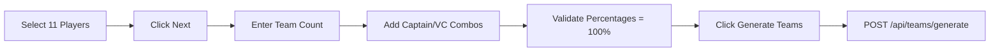
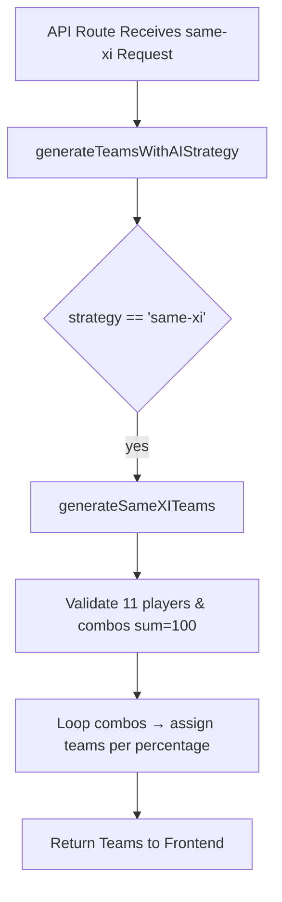

# Strategy 2: Same XI, Different Captains

## 1. Introduction
**Strategy 2** allows you to select a fixed 11-player base team and generate multiple fantasy teams by varying only the captain and vice-captain assignments according to specified percentage distributions. This approach maximizes leadership diversity while keeping player selections constant.

## 2. User Workflow

1. **Select Base XI** (`components/strategies/Strategy2Wizard.tsx`, _selection stage_)
   - Displays active players from both teams.
   - User toggles players to build exactly 11-player roster under a 100-credit cap.
   - Once 11 players are selected, clicks **Next: Set Captains**.

2. **Define Captain/Vice-Captain Distribution** (_distribution stage_)
   - Enter number of teams to generate (1–50).
   - Add one or more combinations: pick captain, vice-captain from the 11 selected players and assign a percentage.
   - Total of all percentages must equal 100%.
   - Click **Generate Teams** to invoke generation.

3. **Team Generation Request**
   ```ts
   onGenerate({
     strategy: 'same-xi',
     players: selectedPlayers,        // Array of 11 player objects
     combos: validCombos              // [{ captain, viceCaptain, percentage }, ...]
   }, teamCount);
   ```
   - `generateTeams(matchId, 'same-xi', teamCount, userPreferences)` sends:
   ```ts
   POST /api/teams/generate
   body: { matchId, strategy: 'same-xi', teamCount, userPreferences }
   ```

## 2.1 Frontend Workflow Diagram

**Diagram Explanation:**
- User flows from player selection to distribution setup.
- Percentages validation ensures correct leadership mix.
- Final button triggers API call with structured preferences.

## 3. Backend Logic

### 3.1 API Route
- **File**: `app/api/teams/generate/route.ts`
- Validates `strategy === 'same-xi'` and required `userPreferences` fields.
- Calls:
  ```ts
  aiService.generateTeamsWithAIStrategy({
    matchId,
    strategy: 'same-xi',
    teamCount,
    userPreferences: { players, combos }
  });
  ```

### 3.2 AI Service Pipeline
**File**: `lib/ai-service-enhanced.ts`

1. **Entry Point**: `generateTeamsWithAIStrategy(request)`
   ```ts
   if (request.strategy === 'same-xi' && request.userPreferences?.players && request.userPreferences?.combos) {
     return this.generateSameXITeams(request);
   }
   ```

2. **generateSameXITeams(request)**
   ```ts
   const { players, combos } = request.userPreferences!;
   // Validate exactly 11 players
   // Validate combos array and total percentage === 100
   const teams: AITeamAnalysis[] = [];
   let teamIndex = 0;
   for (const combo of combos) {
     const count = round((combo.percentage / 100) * teamCount);
     for (let i = 0; i < count && teamIndex < teamCount; i++) {
       teams.push({
         players,
         captain: find in players matching combo.captain,
         viceCaptain: find matching combo.viceCaptain,
         totalCredits: 100,
         confidence: defaultConfidence,
         // other metadata
       });
       teamIndex++;
     }
   }
   return teams;
   ```

## 3.1 Backend Workflow Diagram

**Diagram Explanation:**
- API handler delegates to `generateSameXITeams`.
- Validates inputs then generates teams by iterating combinations.
- Returns fully populated teams with same XI but varied leadership.

## 4. Key Formulas & Rules

- **Team Count per Combo**:
  ```ts
  teamsForCombo = Math.round((combo.percentage / 100) * teamCount);
  ```
- **Player Constraints**:
  - Must select exactly 11 players.
  - Total credits used ≤ 100.
- **Percentage Validation**:
  ```ts
  totalPercentage = combos.reduce((sum, c) => sum + c.percentage, 0);
  assert(totalPercentage === 100);
  ```

## 5. Data Sources & Dependencies

- **Match Data**: `useMatchData(matchId)` for fetch players endpoint.
- **Player Pool**: `/api/players?matchId&teamName&onlyActive=true`.
- **Hooks**: `useTeamGeneration` & `useMatchData`.

## 6. AI Confidence

- Default `confidence` score assigned per team (e.g., 75).
- Can be adjusted based on user risk profile or combo importance.

## 7. Next Steps
- **Enhance error handling** for invalid combos.
- **Add captain rotation logic** for sequential leadership.
- **Extend UI** to preview each combination before generation.

---
*Generated on {{date}} by Dream11 AI-Intern2025*
