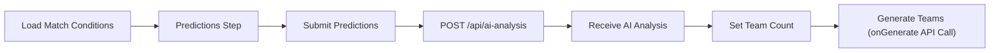
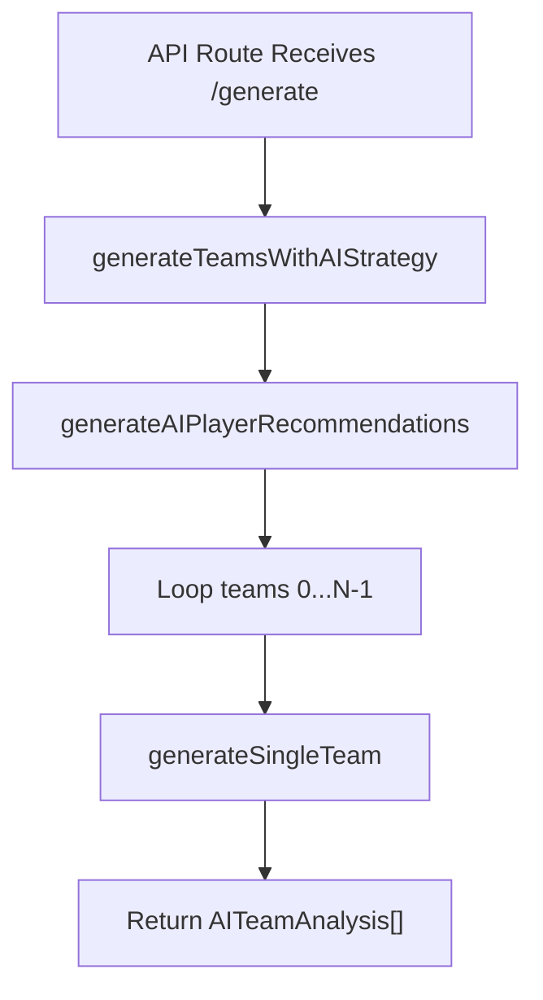

# Strategy 3: Score & Storyline Prediction

## 1. Introduction
**Strategy 3** uses match conditions and your own score predictions to drive an AI analysis, then generates diversified fantasy teams based on the analysis. It combines automated data-driven insights with user intuition for optimized line-ups.

## 2. User Workflow

1. **Auto-Detected Match Conditions** (`components/strategies/Strategy3Wizard.tsx`, conditions step)
   - Format, pitch, weather, venue loaded via `useMatchData(matchId)`.
   - Click **Next: Make Predictions**.

2. **Make Your Predictions** (`predictions` step)
   - For T20/ODI/Test: enter runs expected and wickets conceded or detailed innings predictions and top performers.
   - Click **Next: AI Analysis** once all fields are complete.

3. **AI Analysis** (`analysis` step)
   - Invokes POST `/api/ai-analysis` with match conditions and `userPredictions`.
   - AI returns structured analysis JSON (format, predictions, favoredRoles, corePlayerCount, strategy).
   - Once analysis completes, UI advances to **Generation**.

4. **Generate Teams** (`generation` step)
   - Select number of teams (1–50).
   - Click **Generate X Teams** button.
   - Calls:
     ```ts
     onGenerate({ 
       strategy: 'differential',
       aiAnalysis,
       userPredictions,
       matchConditions: { format, pitch, weather, venue },
       team1Name,
       team2Name
     }, teamCount)
     ```

### 2.1 Frontend Workflow Diagram

**Diagram Explanation:**
- Steps A→B to present conditions and collect predictions.
- C→D kicks off AI analysis; D→E stores analysis for generation.
- F→G triggers final team-generation API call.

## 3. Backend Logic

### 3.1 AI Analysis API
- **File**: `app/api/ai-analysis/route.ts`
- Accepts POST body: `{ team1, team2, format, pitch, weather, venue, userPredictions }`.
- Builds prompt combining match context and user predictions.
- Calls `aiService.generateAnalysis(prompt)`.
- Returns `{ analysis: string }` JSON string containing analysis.

### 3.2 Team Generation API
- **File**: `app/api/teams/generate/route.ts`
- Validates input: `matchId, strategy==='differential', teamCount, userPreferences` (`aiAnalysis`, `userPredictions`, `matchConditions`, `team1Name`, `team2Name`).
- Calls `aiService.generateTeamsWithAIStrategy(request)`.
- Returns array of `AITeamAnalysis`.

### 3.3 AI Service Pipeline
**File**: `lib/ai-service-enhanced.ts`

1. **Entry Point**: `generateTeamsWithAIStrategy(request)`
   ```ts
   console.log(`🎯 Processing strategy: ${request.strategy}`);
   // No special branch for 'differential' → default fallback
   const recommendations = await this.generateAIPlayerRecommendations(request.matchId);
   const teams: AITeamAnalysis[] = [];
   for (let i = 0; i < request.teamCount; i++) {
     teams.push(await this.generateSingleTeam(recommendations, request, i));
   }
   return teams;
   ```

2. **generateAIPlayerRecommendations(matchId)**
   - Fetches player pool and runs ML model to produce scores (`confidence`, `role`, `reason`, `captaincy_score`).

3. **generateSingleTeam(recommendations, request, teamIndex)**
   - Determines valid Dream11 compositions.
   - **Groups** recommendations by role.
   - **Filters & sorts** by `confidence`.
   - **Selects** players per role respecting credits and team limits.
   - **Fills** remaining slots if under 11.
   - **Validates** composition; falls back if invalid.
   - **Picks** captain/vice-captain via `forceVariedCaptainSelection`.
   - Returns `AITeamAnalysis` with: `players, captain, viceCaptain, totalCredits, roleBalance, riskScore, expectedPoints, confidence, insights`.

#### 3.3 Backend Workflow Diagram

**Diagram Explanation:**
- API route delegates to AI service.
- AI service scores players, then assembles each team with Dream11 constraints.
- Final teams returned to frontend.

## 4. Key Formulas & Rules

- **Runs/Wickets Mapping**: `high/medium/low` → approximate ranges.
- **Team Composition**: Exactly 11 players, ≤100 credits, max 7 from one team.
- **Captain Selection**: `teamIndex % eligibleCaptains.length`.
- **Player Confidence**: 0–1 score from ML model, drives sorting.

## 5. Data Sources & Dependencies

- **Hooks**: `useMatchData(matchId)` for match context.
- **API**: `/api/ai-analysis`, `/api/teams/generate`.
- **AI Models**: `openAIService` / `geminiService`.
- **Validator**: `Dream11TeamValidator`.

## 6. AI Confidence & Insights

- Each `AITeamAnalysis` includes a `confidence` score.
- `insights` may incorporate AI analysis details and narrative rationale.

## 7. Next Steps

- Integrate `aiAnalysis` into `applyStrategyFiltering` to weight picks.
- Build specialized branch in `generateTeamsWithAIStrategy` for 'differential'.
- Enhance fallback to respect user top-performer predictions.
- Add UI preview of AI insights before final generation.

---
*Generated on {{date}} by Dream11 AI-Intern2025*
