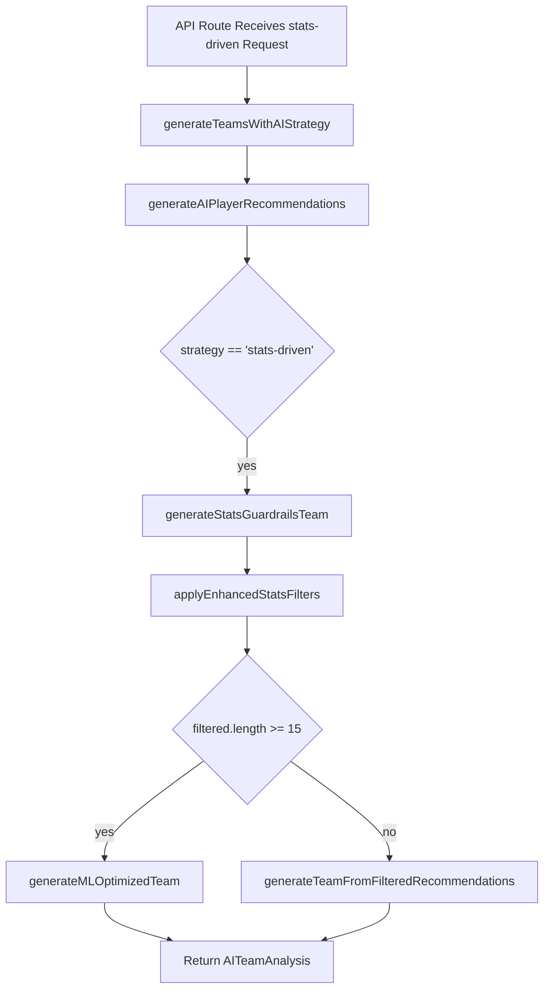

# Strategy 5: Stats-Driven Guardrails

## 1. Introduction
**Strategy 5** applies quantitative filters (“guardrails”) on historical and projected player statistics to constrain team generation. By specifying ranges for Dream Team %, selection %, average points, credits, and role counts, you ensure every lineup meets your criteria and optimizes for performance consistency and risk management.

## 2. User Workflow

1. **Set Guardrails** (`components/strategies/Strategy5Wizard.tsx`, *filters* stage)
   - Adjust sliders for:
     - **Dream Team Percentage** (mandatory): expected ownership in the official Dream Team.
     - **Selection Percentage** (optional): current ownership share.
     - **Average Points** (optional): recent scoring average.
     - **Credits** (optional): individual player price range.
   - Define **Role Composition**: min/max counts for Batsmen, Bowlers, All-Rounders, Wicket-Keepers.
   - Click **Save Guardrails** after validating at least one non-Dream Team filter.

2. **Review & Generate** (`*summary*` stage)
   - Preview summary narrative generated by `generateSummary()`.
   - Adjust **Number of Teams** (1–50).
   - Click **Generate X Teams** → calls:
     ```ts
     onGenerate({
       strategy: 'stats-driven',
       filters,
       summary: generateSummary()
     }, teamCount);
     ```

### 2.1 Frontend Workflow Diagram
```mermaid
flowchart LR
  A[Open Stats-Driven Wizard] --> B[Set Filters & Roles]
  B --> C[Click Save Guardrails]
  C --> D[Review Summary & Team Count]
  D --> E[Generate Teams (onGenerate)]
```  
**Diagram Explanation:**
- A→B: user adjusts quantitative guardrails and role constraints.
- B→C: validation and transition to summary stage.
- D→E: triggers API call with structured filter preferences.

## 3. Backend Logic

### 3.1 API Route
- **File**: `app/api/teams/generate/route.ts`
- Parses POST body: `{ matchId, strategy, teamCount, userPreferences }`.
- Validates:
  ```ts
  strategy === 'stats-driven' && userPreferences.filters;
  ```
- Calls:
  ```ts
  aiService.generateTeamsWithAIStrategy({
    matchId,
    strategy: 'stats-driven',
    teamCount,
    userPreferences
  });
  ```
- Returns `AITeamAnalysis[]`.

### 3.2 AI Service Pipeline
**File**: `lib/ai-service-enhanced.ts`

1. **Entry Point**: `generateTeamsWithAIStrategy(request)`
   ```ts
   const recommendations = await this.generateAIPlayerRecommendations(request.matchId);
   const teams: AITeamAnalysis[] = [];
   for (let i = 0; i < request.teamCount; i++) {
     teams.push(await this.generateSingleTeam(recommendations, request, i));
   }
   return teams;
   ```

2. **generateSingleTeam** (detects `strategy === 'stats-driven'`)
   ```ts
   if (request.strategy === 'stats-driven' && request.userPreferences?.filters) {
     return this.generateStatsGuardrailsTeam(recommendations, request, teamIndex);
   }
   ```

3. **generateStatsGuardrailsTeam(recs, request, index)**
   ```ts
   const filters = request.userPreferences.filters;

   // 1. Compute ML player scores
   const players = recs.map(r => r.player);
   const matchContext = { /* match metadata */ };
   const mlScores = await mlOptimizationService.generateMLPlayerScores(players, matchContext);

   // 2. Apply enhanced statistical filters
   const filtered = this.applyEnhancedStatsFilters(recs, mlScores, filters);

   if (filtered.length === 0) {
     return this.generateFallbackTeam(recs, request, index);
   }

   // 3. Choose generation method
   if (filtered.length >= 15) {
     return this.generateMLOptimizedTeam(filtered, mlScores, matchContext, filters, request, index);
   } else {
     return this.generateTeamFromFilteredRecommendations(filtered, recs, filters, request, index);
   }
   ```

4. **applyEnhancedStatsFilters(recs, mlScores, filters)**
   - Filters each recommendation by:
     - `dream_team_percentage` within [min, max]
     - Optional: `selection_percentage`, `points`, `credits` within ranges
     - Role counts enforced later in team assembly
   - Returns `AIPlayerRecommendation[]` matching all criteria.

5. **Team Assembly**
   - In `generateMLOptimizedTeam`: uses ML optimization to maximize projected points subject to filters.
   - In `generateTeamFromFilteredRecommendations`: greedy fill respecting:
     - Dream11 composition rules (11 players, ≤100 credits, ≤7 per side)
     - Role counts from `filters.playerRoles`
   - Selects captain/vice-captain via `forceVariedCaptainSelection`.
   - Computes metrics: `roleBalance`, `riskScore`, `expectedPoints`, `confidence`, `insights`.

#### 3.3 Backend Workflow Diagram

**Diagram Explanation:**
- API → recommendations → branch to stats-driven logic.
- Filters applied, then ML or greedy team generation.
- Final teams returned to UI.

## 4. Key Formulas & Rules

- **Filter Enforcements**:
  ```ts
  passes =
    player.dream_team_percentage >= filters.dreamTeamPercentage.min &&
    player.dream_team_percentage <= filters.dreamTeamPercentage.max;
  // plus optional filters for selection_percentage, averagePoints, credits
  ```

- **Role Composition**:
  Enforced during assembly: each role’s count within `[filters.playerRoles[role].min, max]`.

- **Capacity Constraints**:
  - Exactly 11 players, total credits ≤100, ≤7 per real team.
  - Use `Dream11TeamValidator.generateValidTeamCompositions()` to guide fill order.

- **ML Optimization**:
  - `mlOptimizationService.generateMLPlayerScores` returns predictive scores.
  - Team built via solver to maximize sum of ML scores under constraints.

## 5. Data Sources & Dependencies

- **Match Data**: `useMatchData(matchId)` for basic context.
- **AI Player Recommendations**: `generateAIPlayerRecommendations(matchId)`.
- **ML Optimization Service**: `ml-optimization` module.
- **Dream11 Validator**: composition rules and validation.
- **Hooks**: `useTeamGeneration` for API integration.

## 6. AI Confidence & Insights

- **Confidence**: aggregated from ML scores or fallback logic.
- **Insights**: descriptive strings summarizing filters applied and any trade-offs (e.g., "Used ML solver to maximize points at 95% confidence").

## 7. Next Steps

- Expose more filters (e.g., consistencyScore, venuePerformance).
- Allow weight adjustments between filters (e.g., 70% Dream Team %, 30% Average Points).
- Visual preview of filtered player pool.
- Integrate user risk profile to shrink/expand filter ranges.

---
*Generated on {{date}} by Dream11 AI-Intern2025*
