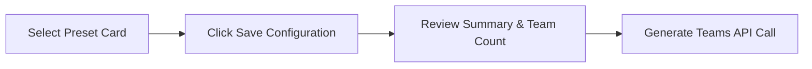
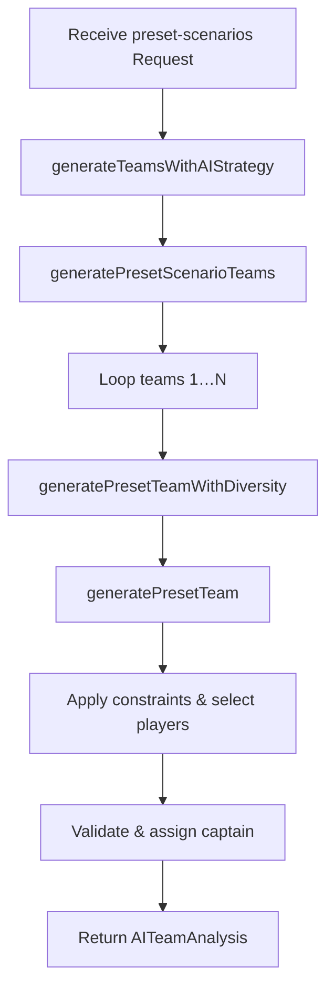

# Strategy 6: Preset Scenarios & Configurations

## 1. Introduction
**Strategy 6** offers turnkey, scenario-driven lineups based on pre-defined match heuristics—"presets"—tailored to common cricket situations (high-scoring team, collapse scenarios, differential contrarian plays, balanced roles, etc.). Each preset encapsulates focus constraints, risk level, and tags, then generates diversified teams honoring those rules and ensuring at least 25% roster variation.

## 2. User Workflow

1. **Choose Preset** (`components/strategies/Strategy6Wizard.tsx`, *presets* stage)
   - Browse cards for each preset (e.g., Team A High Total, High Differentials, All-Rounder Heavy).
   - Inspect description, strategy narrative, tags, and risk badge.
   - Click to select; selected card is highlighted.
   - View auto-loaded match conditions (pitch, weather, venue) for context.

2. **Review & Configure** (`*summary*` stage)
   - Confirm preset details (name, description, strategy, risk level, tags).
   - Adjust number of teams (1–50) via +/- buttons.
   - Preview AI strategy summary (incorporates preset name and match conditions).

3. **Generate Teams**
   - Click **Generate X Teams** → calls:
     ```ts
     onGenerate({
       preset,               // PresetConfiguration object
       teamNames,            // { teamA, teamB }
       matchConditions       // { pitch, weather, venue }
     }, teamCount);
     ```

### 2.1 Frontend Workflow Diagram

**Diagram Explanation:**
- A→B: preset selection persists in state.
- B→C: user confirms preset and number of teams.
- C→D: triggers `/api/teams/generate` with strategy="preset-scenarios" and payload.

## 3. Backend Logic

### 3.1 API Route
- **File**: `app/api/teams/generate/route.ts`
- Validates request JSON:
  ```ts
  strategy === 'preset-scenarios';
  userPreferences.preset && userPreferences.teamNames;
  ```
- Delegates to AI service:
  ```ts
  aiService.generateTeamsWithAIStrategy({
    matchId,
    strategy: 'preset-scenarios',
    teamCount,
    userPreferences
  });
  ```
- Returns array of `AITeamAnalysis`.

### 3.2 AI Service Entry
**File**: `lib/ai-service-enhanced.ts`
```ts
if (request.strategy === 'preset-scenarios' && request.userPreferences?.preset) {
  return this.generatePresetScenarioTeams(request);
}
```

### 3.3 Preset Strategy Service
**File**: `lib/preset-strategy-service.ts`

1. **generatePresetTeams(request)**
   - Fetch `PresetConfiguration` by `presetId`.
   - Load match and active players via `neonDB`.
   - Loop `teamCount` times:
     ```ts
     team = await this.generatePresetTeamWithDiversity(
       preset, players, match, request, index, existingTeams
     );
     ```
   - Enforce diversity (≥25% unique players) with up to 50 attempts per team.

2. **generatePresetTeamWithDiversity**
   - Repeat:
     - Call `generatePresetTeam` → candidate roster.
     - Compute `diversityScore = uniquePlayers(candidate, existing) / 11 * 100`.
     - Accept when `diversityScore ≥ 25` or on best of N attempts.

3. **generatePresetTeam**
   - **applyPresetConfiguration**: merges `preset.constraints` (e.g., `minBatsmen`, `teamBBowlers`) into config.
   - **filter & sort players** according to constraints:
     - E.g., for `team-a-high-total`: select batsmen where `player.team_name === teamA` first.
     - For `high-differentials`: filter `selection_percentage < 20`, sort by projected points desc.
     - For role-focused presets: enforce min counts before fill.
   - **fill remaining slots** obeying Dream11 rules:
     - 11 players, ≤100 credits, max 7 per real team.
     - Use `Dream11TeamValidator` to guide composition.
   - **assign captain/vice-captain** using `forceVariedCaptainSelection` or preset order.
   - **compute metrics**: `roleBalance`, `riskScore`, `expectedPoints`, `confidence`, `insights`, `reasoning`.

#### 3.4 Backend Workflow Diagram

**Diagram Explanation:**
- Pipeline from API to AI service to preset strategy service.
- Diversity loop ensures roster variation.
- Each team built per preset constraints and Dream11 rules.

## 4. Preset-by-Preset Deep Dive

### 4.1 Team A High Total, Team B Collapse
- **Constraints**: `teamABatsmen ≥ 5`, `teamBBowlers ≥ 3`.
- **Logic**:
  1. Filter `players.filter(p => p.team_name === teamA && p.player_role === 'BAT')`, take top 5 by `projectedPoints`.
  2. Filter `players.filter(p => p.team_name === teamB && p.player_role === 'BWL')`, take top 3.
  3. Fill remaining 3 slots with highest `confidence` recs.
- **Example** (Team 0):
  ```txt
  [A1,A2,A3,A4,A5] from Team A batsmen
  [B1,B2,B3] from Team B bowlers
  [X,Y,Z] fill via validator
  ```

### 4.2 High Differentials Strategy
- **Constraints**: `selection_percentage < 20%`.
- **Logic**:
  1. Filter low-ownership: `p.selection_percentage < 20`.
  2. Sort by `(p.projectedPoints * (1 - p.selection_percentage/100))` desc.
  3. Select top 11 ensuring role balance via `generateValidTeamCompositions()`.
- **Example**:
  ```ts
  differentialRecs = recs.filter(r => r.player.selection_percentage < 20);
  sorted = differentialRecs.sort((a,b) => ...);
  pick first 11 valid → team.
  ```

### 4.3 Team B High Total, Team A Collapse
- **Constraints**: `teamBBatsmen ≥ 5`, `teamABowlers ≥ 3`.
- **Logic**:
  1. Select top 5 Team B batsmen by projected points.
  2. Select top 3 Team A bowlers by confidence.
  3. Fill 3 remaining slots with highest-confidence recs.
- **Example**:
  ```txt
  [B1,B2,B3,B4,B5] from Team B batsmen
  [A1,A2,A3] from Team A bowlers
  [X,Y,Z] fill via validator
  ```

### 4.4 Balanced Roles (4 BAT, 3 BOWL, 2 AR, 1 WK)
- **Constraints**: enforce exactly 4 batsmen, 3 bowlers, 2 all-rounders, 1 wicket-keeper.
- **Logic**:
  1. Pick top 4 BAT by confidence.
  2. Pick top 3 BWL, 2 AR, 1 WK.
  3. Fill last slot with next-highest rec under credit cap.
- **Example**:
  ```ts
  batsmen = sorted.filter(r=>r.role==='BAT').slice(0,4);
  bowlers=sorted.filter(r=>r.role==='BWL').slice(0,3);
  allRounders=sorted.filter(r=>r.role==='AR').slice(0,2);
  wk=sorted.filter(r=>r.role==='WK')[0];
  remaining=pickNextBest(sortedExcluding([...]),1);
  ```

### 4.5 All-Rounder Heavy Lineup
- **Constraints**: minimum 4 all-rounders.
- **Logic**:
  1. Select top 4 AR by projectedPoints.
  2. Fill remaining 7 slots with highest-confidence recs respecting Dream11 rules.
- **Example**:
  ```txt
  [AR1,AR2,AR3,AR4] then fill [X1,X2,...] to complete 11.
  ```

### 4.6 Top Order Batting Stack
- **Constraints**: 4 top-order batsmen (positions 1–3).
- **Logic**:
  1. Filter p.position ≤3, pick top 4 by projectedPoints.
  2. Fill remaining 7 slots with highest-confidence recs.
- **Example**:
  ```txt
  [Op1,Op2,Op3,Op4] then fill others via validator.
  ```

### 4.7 Bowling Pitch Special
- **Constraints**: minimum 5 bowlers.
- **Logic**:
  1. Select top 5 BWL matching pitch style.
  2. Fill remaining 6 slots greedily by confidence and credits.
- **Example**:
  ```txt
  [BWL1,BWL2,...,BWL5] then fill [X,Y,Z...] to 11.
  ```

### 4.8 Death Overs Specialists
- **Constraints**: 4 death overs specialists.
- **Logic**:
  1. Filter players tagged 'death-overs', pick top 4 by specialty score.
  2. Fill 7 remaining slots with balanced picks.
- **Example**:
  ```txt
  [D1,D2,D3,D4] then fill rest via validator.
  ```

## 5. Key Formulas & Calculations

- **Diversity Score**:
  ```ts
  diversityScore = uniquePlayers(candidate, existing) / 11 * 100;
  require diversityScore ≥ 25;
  ```
- **Role Enforcement**: e.g. `count(p => p.player_role === 'AR') ≥ constraints.minAllRounders`.
- **Credit Cap Check**: totalCredits = sum(p.credits) ≤ 100.
- **Team Composition**: uses `Dream11TeamValidator.generateValidTeamCompositions()` patterns.

## 6. Data Sources & Dependencies

- **Match Data**: `neonDB.getMatchById`, `neonDB.getPlayingPlayersForMatch`
- **Preset Definitions**: in `lib/preset-strategy-service.ts`
- **AI Service Entry**: `lib/ai-service-enhanced.ts` → `presetStrategyService`
- **Validator**: `Dream11TeamValidator`

## 7. Next Steps

- Visualize each preset’s constraint satisfaction (e.g., highlight top-5 batsmen selected).
- Allow custom tuning of preset constraints in UI.
- Add more scenario presets (weather, toss result, recent form).
- Integrate match odds or external data sources to refine presets.

---
*Generated on {{date}} by Dream11 AI-Intern2025*
