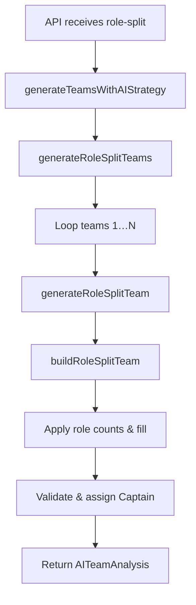

# Strategy 7: Role-Split Lineups

## 1. Introduction
**Strategy 7** allows you to define exact role distributions—batting order splits, bowling type splits, and core roles—then generates teams that adhere strictly to your configuration while enforcing Dream11 rules and roster diversity. This gives full control over team composition structure.

## 2. User Workflow

1. **Configure Role-Split** (`components/strategies/Strategy7Wizard.tsx`, *configure* stage)
   - Choose from **Quick Presets** or manually adjust:
     - **Batting Order**: `topOrderBatsmen` (positions 1–3), `middleOrderBatsmen` (4–6), `lowerOrderBatsmen` (7–11).
     - **Bowling Split**: number of `spinners` and `pacers`.
     - **Core Roles**: `allRounders` and `wicketKeepers`.
     - **Team Count**, **Diversity Level**, **Prioritize Form**, **Balance Credits**.
   - Validation: sum of all role counts must equal 11.
   - Click **Continue to Summary**.

2. **Review & Generate** (`*summary*` stage)
   - Preview configuration overview and AI strategy summary.
   - Adjust number of teams if needed.
   - Click **Generate X Teams** → calls:
     ```ts
     onGenerate({
       strategy: 'role-split',
       roleSplitConfig: config,
       teamNames: { teamA, teamB },
       matchConditions: { pitch, weather, venue }
     }, config.teamCount);
     ```

### 2.1 Frontend Workflow Diagram
```mermaid
flowchart LR
  A[Configure Role-Split] --> B[Validate & Save Config]
  B --> C[Review Summary]
  C --> D[Generate Teams (onGenerate)]
```  
**Diagram Explanation:**
- A→B: user defines exact role ratios and validation passes.
- B→C: summary & team count confirmation.
- C→D: triggers generation API call with structured config.

## 3. Backend Logic

### 3.1 API Route
- **File**: `app/api/teams/generate/route.ts`
- Validates:
  ```ts
  strategy === 'role-split';
  userPreferences.roleSplitConfig && userPreferences.teamNames;
  ```
- Calls:
  ```ts
  aiService.generateTeamsWithAIStrategy({
    matchId,
    strategy: 'role-split',
    teamCount,
    userPreferences
  });
  ```
- Returns `AITeamAnalysis[]`.

### 3.2 AI Service Entry
**File**: `lib/ai-service-enhanced.ts`
```ts
if (request.strategy === 'role-split' && request.userPreferences?.roleSplitConfig) {
  return this.generateRoleSplitTeams(request);
}
```

### 3.3 generateRoleSplitTeams
```ts
async generateRoleSplitTeams(request) {
  const { roleSplitConfig, teamNames } = request.userPreferences;
  // Fetch match & players
  for (let i = 0; i < roleSplitConfig.teamCount; i++) {
    teams.push(
      await this.generateRoleSplitTeam(
        roleSplitConfig, players, match, request, i, teams
      )
    );
  }
  return teams;
}
```
- Ensures each team meets config and diversity.

### 3.4 generateRoleSplitTeam
```ts
async generateRoleSplitTeam(config, players, match, request, idx, existing) {
  let attempts = 0, bestTeam=null, bestScore=-1;
  while (attempts < maxAttempts) {
    const candidate = await this.buildRoleSplitTeam(config, players, match, request, idx+attempts);
    const score = this.calculateTeamDiversityScore(candidate, existing);
    if (score >= threshold || existing.length === 0) return candidate;
    if (score > bestScore) bestTeam = candidate;
    attempts++;
  }
  return bestTeam;
}
```
- Loops to satisfy diversity level (10–50%).

### 3.5 buildRoleSplitTeam
```ts
async buildRoleSplitTeam(config, players, match, request, seed) {
  // 1. Apply config: role counts for batting, bowling, AR, WK
  // 2. Analyze players for AI scoring (prioritize form, balance credits)
  // 3. Group players by role
  // 4. Pick per config: topOrderBatsmen from WK+BAT pools, etc.
  // 5. Fill leftover slots by confidence and validator
  // 6. Validate composition, fallback if invalid
  // 7. Assign captain/vice-captain
  return teamAnalysis;
}
```

#### 3.6 Backend Workflow Diagram


## 4. Key Formulas & Rules

- **Total Roles Check**: sum of config counts === 11.
- **Diversity Threshold**:
  ```ts
  threshold = { low: 10, medium: 25, high: 35 }[config.diversityLevel];
  ```
- **Diversity Score**:
  ```ts
  uniqueCount = count of players not in existing teams;
  score = (uniqueCount / 11) * 100;
  ```
- **Team Composition**: Dream11 rules (≤7 per side, ≤100 credits).
- **Captaincy Variation**: `teamIndex % eligibleCaptains.length`.

## 5. Example Walkthrough
Assume config:
```js
config = {
  topOrderBatsmen: 3, middleOrderBatsmen: 3, lowerOrderBatsmen: 1,
  spinners: 2, pacers: 1, wicketKeepers: 1, allRounders: 1,
  teamCount: 2, diversityLevel: 'medium'
};
```

**Team 0**:
1. Pick 3 top-order batsmen by form.
2. Pick 3 middle-order batsmen.
3. Pick 1 lower-order batsman.
4. Pick 2 spinners, 1 pacer.
5. Pick 1 wicket-keeper, 1 all-rounder.
6. Fill 1 slot remains with next-highest rec (validator ensures roles).
7. Assign captain among top-order picks.

**Team 1** repeats with rotation for variation and then checks diversity ≥25%.

## 6. Data Sources & Dependencies

- **Match Data**: `useMatchData(matchId)`.
- **AI Service**: `generateRoleSplitTeams` and related methods in `ai-service-enhanced.ts`.
- **DB**: `neonDB` for player lists.
- **Validator**: `Dream11TeamValidator`.

## 7. AI Confidence & Insights

- Each team includes `confidence` score aggregated from player ratings.
- `insights` describe adherence to config and any fallback actions.

## 8. Next Steps

- Add visualization of role-split distribution per team.
- Expose rotation seed control for reproducible variation.
- Allow hybrid presets mixing core-hedge with role-split.

---
*Generated on {{date}} by Dream11 AI-Intern2025*
