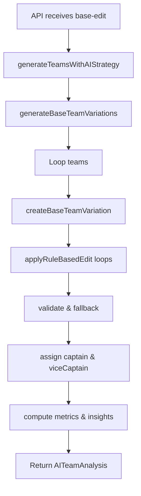

# Strategy 8: Base Team + Rule-Based Edits

## 1. Introduction
**Strategy 8** starts with a user-defined "base team" of 11 players, then systematically applies rule-based edits to generate multiple lineup variations. You control which metrics to optimize, set guardrails on composition, and choose edit intensity, while the AI ensures all Dream11 constraints and diversity across teams.

## 2. User Workflow

1. **Select Base Team** (`components/strategies/Strategy8Wizard.tsx`, *baseTeam* stage)
   - Fetch active players for both teams via `useMatchData(matchId)`.
   - Click **+** to add up to 11 players; deselect with **−**.
   - UI displays counts: total selected, credits, team split, role split (BAT-BWL-AR-WK).
   - Click **Define Optimization Rules** once 11 players chosen.

2. **Define Optimization Rules** (`*rules*` stage)
   - **Primary Parameter**: Dream Team %, Selection %, or Average Points.
   - **Guardrails**: maximum per-role (batsmen, bowlers, all-rounders, keepers), credit range (min/max).
   - **Preferences**: bowling style, batting order bias, risk tolerance.
   - **Edit Intensity**: minor (1–2 swaps), moderate (2–4), major (3–6).
   - Click **Review Summary**.

3. **Review & Generate** (`*summary*` stage)
   - Preview base team composition and optimization settings.
   - Adjust **Number of Teams** (1–30).
   - Click **Generate X Teams** → calls:
     ```ts
     onGenerate({
       strategy: 'base-edit',
       baseTeam,
       optimizationRules,
       teamNames: { team1, team2 },
       summary: generateSummary()
     }, teamCount);
     ```

### 2.1 Frontend Workflow Diagram
```mermaid
flowchart LR
  A[Select Base Team] --> B[Define Rules]
  B --> C[Review Summary]
- C --> D[Generate Teams]
+ C --> D["Generate Teams"]
```  
**Diagram Explanation:**
- A→B: user picks 11 players.
- B→C: user sets optimization metrics and constraints.
- C→D: API invocation with strategy `base-edit`.

## 3. Backend Logic

### 3.1 API Route
- **File**: `app/api/teams/generate/route.ts`
- Validates body:
  ```ts
  strategy==='base-edit' &&
  userPreferences.baseTeam.length===11 &&
  userPreferences.optimizationRules
  ```
- Calls:
  ```ts
  aiService.generateTeamsWithAIStrategy({
    matchId,
    strategy: 'base-edit',
    teamCount,
    userPreferences
  });
  ```
- Returns array of `AITeamAnalysis`.

### 3.2 AI Service Entry
**File**: `lib/ai-service-enhanced.ts`
```ts
if ((request.strategy==='base-edit' ||
     request.strategy==='strategy8') &&
    request.userPreferences?.baseTeam) {
  return this.generateBaseTeamVariations(request);
}
```

### 3.3 generateBaseTeamVariations
```ts
async generateBaseTeamVariations(request) {
  const { baseTeam, optimizationRules } = request.userPreferences;
  const allPlayers = await neonDB.getPlayingPlayersForMatch(request.matchId);
  for (let i=0; i<request.teamCount; i++) {
    teams.push(await this.createBaseTeamVariation(
      baseTeam, allPlayers, optimizationRules, i
    ));
  }
  return teams;
}
```
- Iterates per team index to apply variations.

### 3.4 createBaseTeamVariation
```ts
async createBaseTeamVariation(baseTeam, allPlayers, rules, teamIndex) {
  let current = [...baseTeam];
  editsToMake = this.determineEdits(rules.editIntensity, teamIndex);
  for (let e=0; e<editsToMake; e++) {
    current = this.applyRuleBasedEdit(current, allPlayers, rules, teamIndex, e);
  }
  if (!validateTeamComposition(current)) current = [...baseTeam];
  const { captain, viceCaptain } = this.selectCaptaincyVariation(current, teamIndex);
  return this.buildAITeamAnalysis(current, captain, viceCaptain);
}
```
- Swaps players according to `applyRuleBasedEdit`:
  - Respects guardrails (max per-role, credit range).
  - Applies preferences (bowling style, batting order, risk).
  - Swaps one player at a time for systematic variation.

#### 3.5 determineEdits
- **Minor**: `edits = teamIndex%3===0 ? 1 : 2` swaps.
- **Moderate**: `edits = 2 + teamIndex%3` (2–4 swaps).
- **Major**: `edits = 3 + teamIndex%4` (3–6 swaps).

#### 3.6 buildAITeamAnalysis
- Calculates:
  - `totalCredits` = sum of credits ≤100.
  - `roleBalance` via `calculateRoleBalance`.
  - `expectedPoints` via `calculateExpectedPoints` (basePoints + captain bonus + vice-captain bonus).
  - `confidence` via `calculateTeamConfidence` (aggregates player confidence).
  - `insights` and `reasoning` summarizing edits.

#### 3.7 Backend Workflow Diagram


## 4. Key Formulas & Rules

- **Edit Intensity Mapping**:
  ```ts
  minor: 1-2 swaps; moderate: 2-4; major: 3-6;
  ```
- **Guardrails Check**:
  ```ts
  count(role)<=rules.guardrails.maxPerRole[role];
  totalCredits between minCredits and maxCredits;
  ```
- **Expected Points**:
  ```ts
  basePoints = sum(p.points);
  + captain.points * 1.0
  + viceCaptain.points * 0.5;
  ```
- **Captain Variation**: `teamIndex % eligibleCaptains.length`.

## 5. Example Walkthrough
Assume:
```js
baseTeam = [11 players];
rules = { editIntensity:'moderate', guardrails:{maxPerRole:{batsmen:6,...}, minCredits:95,maxCredits:100}, preferences:{...} };
teamCount=2;
```
**Team 0**:
- `edits=2 + 0%3 = 2` swaps:
  1. Swap one lower-ranked batsman for higher average-points player under guardrails.
  2. Swap one all-rounder to adjust credit distribution.
- Validate composition; assign captain from top performers.
- Compute metrics & return.

**Team 1**:
- `edits=2+1=3` swaps using next eligible candidates.
- Variation ensures each team differs from base and each other.

## 6. Data Sources & Dependencies

- **Match Data**: `neonDB.getPlayingPlayersForMatch`.
- **AI Service**: `generateBaseTeamVariations`, `createBaseTeamVariation` in `ai-service-enhanced.ts`.
- **Validator**: `Dream11TeamValidator` for composition checks.

## 7. Next Steps

- Expose individual swap logs in `insights` for transparency.
- Add UI preview of each variation’s edits.
- Allow weighting between edit intensity and primary metric.

---
*Generated on {{date}} by Dream11 AI-Intern2025*
